<section class="cover">
<h1 class="cover-title">Piano Without Fear of Black Keys</h1>

A transposition-first manual for piano, Ableton Push/Note, and guitar

Tomás Laurenzo

<a href="mailto:tomas@laurenzo.net">tomas@laurenzo.net</a> · <a href="https://laurenzo.net">laurenzo.net</a>

Version 1.3 - September 2026

For two readers at once: an absolute beginner who needs music from first principles, and an experienced guitarist/electronic musician who wants piano harmony to become transposable rather than trapped in C major / A minor / D Dorian.

Function → pitch spelling → register → instrument geometry

</section>

## Preface

This is not a general piano method. It has a narrower goal: make **scales, chords, arpeggios, voicings, and progressions transposable** on a keyboard whose physical geometry changes from key to key. It starts from first principles so a new musician can use it, but everything points back to that goal.

You do **not** need to read staff notation, have perfect pitch, memorize every key signature, or already know piano fingering. You need a keyboard or piano, a few minutes of focused practice, and the willingness to say note names and interval formulas before speed becomes important.

### Two ways through the book

| Reader | Start here | Main route | Use as reference |
| --- | --- | --- | --- |
| **Absolute beginner** | Preface, then Part I | Parts I-IV, then the beginner program in Part VI | Part VII and Appendices A-E when an exercise asks for them |
| **Guitar / Push / Note player** | Skim Part I | Parts III-VI, translating every object onto piano | Part VII and the all-key appendices |

Appendix F (negative harmony) is optional. Appendix G documents sources and product-layout details. Neither is required for the main learning path.

### How to read every musical example

The book uses the same four-layer translation throughout:

`function → pitch spelling → register → instrument geometry`

For example, a minor seventh chord is always:

`1 b3 5 b7`

On D, that becomes:

`D F A C`

That spelling still does not tell you *which* D, F, A, and C. A concrete voicing might be `D3 F3 A3 C4`; another might place the same chord an octave higher. The pitch classes and harmonic function are the same, but the sounding pitches and physical locations are not.

On piano, guitar, Push, or Note, those pitches occupy different physical places. When an exercise feels difficult, move backward through the chain: say the formula, spell the pitch classes, choose the register, then find those exact pitches on the instrument.

Roman numerals describe **chords by scale degree**. Uppercase normally means major; lowercase means minor. Thus `ii-V-I` in C major means `Dm-G-C`. A flat or sharp before a Roman numeral alters that chord root relative to the reference scale: `bVI` means a chord rooted on the lowered sixth degree.

<strong>Symbols at a glance.</strong> <code>#</code> = sharp (one semitone higher); <code>b</code> = flat (one semitone lower); <code>m</code> = minor; <code>maj</code> = major; <code>dim</code> or <code>°</code> = diminished. Finger numbers run from <code>1</code> (thumb) to <code>5</code> (little finger).

### Your first ten minutes

1. Find C: it is the white key immediately to the left of every group of two black keys.
2. Play `C D E F G` slowly and say the letter names.
3. Play `C E G` and say `1 3 5`: this is a C major triad.
4. Play `C Eb G` and say `1 b3 5`: this is a C minor triad.
5. Move the same two formulas to D: `D F# A` and `D F A`. Do not copy the C hand shape; rebuild the formulas.

That last step is the entire book in miniature: **the musical object stays invariant while the piano geometry changes**.

### Quick glossary

<table class="glossary">
<thead><tr><th>Term</th><th>Meaning</th><th>Term</th><th>Meaning</th></tr></thead>
<tbody>
<tr><td><strong>Pitch</strong></td><td>How high or low a sound is.</td><td><strong>Note</strong></td><td>A named pitch, such as C, F#, or Bb.</td></tr>
<tr><td><strong>Semitone</strong></td><td>The smallest step on a piano; one adjacent key.</td><td><strong>Octave</strong></td><td>Twelve semitones; the same note name at a higher or lower register.</td></tr>
<tr><td><strong>Key</strong></td><td>A tonal center plus the pitch relationships organized around it.</td><td><strong>Tonic</strong></td><td>Scale degree 1: the tonal home of a key or mode.</td></tr>
<tr><td><strong>Root</strong></td><td>The note that names and organizes a chord.</td><td><strong>Interval</strong></td><td>The distance between two pitches.</td></tr>
<tr><td><strong>Scale degree</strong></td><td>A note's numbered function inside a scale: 1, 2, 3, etc.</td><td><strong>Scale</strong></td><td>An ordered collection of pitches around a tonic.</td></tr>
<tr><td><strong>Mode</strong></td><td>A scale pattern understood through a particular tonic and interval structure.</td><td><strong>Chromatic</strong></td><td>Using all twelve semitone positions rather than only one scale.</td></tr>
<tr><td><strong>Diatonic</strong></td><td>Belonging to the notes/chords generated by a seven-note key or mode.</td><td><strong>Enharmonic</strong></td><td>Different spellings for the same piano key, such as C# and Db.</td></tr>
<tr><td><strong>Chord</strong></td><td>Several pitches heard as one harmonic object.</td><td><strong>Triad</strong></td><td>A three-note chord built from root, third, and fifth.</td></tr>
<tr><td><strong>Inversion</strong></td><td>A chord reordered so a note other than the root is lowest.</td><td><strong>Voicing</strong></td><td>The particular register, spacing, and ordering of chord tones.</td></tr>
<tr><td><strong>Arpeggio</strong></td><td>A chord played as successive notes rather than simultaneously.</td><td><strong>Transposition</strong></td><td>Moving a musical structure to a new pitch level while preserving its relationships.</td></tr>
<tr><td><strong>Voice leading</strong></td><td>How individual notes move from one chord to the next.</td><td><strong>Isomorphic</strong></td><td>A layout where a given interval keeps the same physical shape after transposition.</td></tr>
<tr><td><strong>Register</strong></td><td>The region of pitch space in which notes sound.</td><td><strong>Scientific pitch notation</strong></td><td>The octave-number convention used in this book: middle C is C4, and the octave number changes at C. Some software labels the same pitches with different octave numbers.</td></tr>
</tbody>
</table>

<strong>Diagram convention.</strong> Copper marks the tonic/root; teal marks selected chord or scale tones; normal white/black or pale controller pads remain available pitches. Color is an annotation, not a different tuning system.

## Contents

1. Preface - how to read the book and quick glossary
2. Music from first principles
3. Three geometries for the same music
4. Keys, scales, modes, and tonal maps
5. Chords, inversions, voicings, and arpeggios
6. Transposition as a systematic skill
7. Practice programs
8. Compact reference
9. Appendix A - all seven modes in all 12 roots
10. Appendix B - common scales in all 12 roots
11. Appendix C - chord spelling tables
12. Appendix D - progressions in all keys
13. Appendix E - drill cards
14. Appendix F - negative harmony
15. Appendix G - sources and product-layout notes

# Part I - Music from first principles

## 1. Pitch, semitone, and octave

On a modern piano, an octave is divided into 12 equal semitone steps (12-tone equal temperament). After 12 semitones, note names repeat at double the frequency.

The chromatic cycle is:

`C - C#/Db - D - D#/Eb - E - F - F#/Gb - G - G#/Ab - A - A#/Bb - B - C`

A piano makes this cycle visually uneven: seven white-note names and five black keys. A guitar makes it nearly uniform: every fret is one semitone. Push in Chromatic mode can also make semitone relationships geometrically regular.

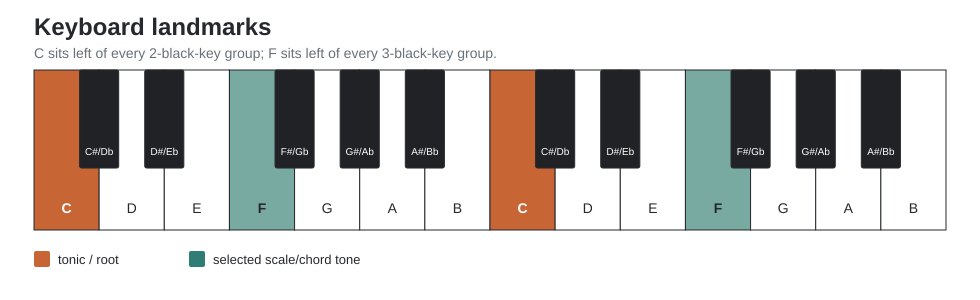

### Exercise 1 - Find every C

1. On the piano, find a group of two black keys.
2. The white key immediately to its left is C.
3. Find every C available without counting from another note.
4. Repeat for F: it is immediately left of each group of three black keys.
5. Close your eyes, move your hand, reopen, and orient yourself from the black-key groups.

**Success criterion:** you can identify C and F anywhere on the keyboard in under two seconds.

## 2. Intervals are distances

An interval can be understood as a semitone distance and as a scale-degree function.

| Interval | Semitones | Degree shorthand | From C |
| --- | ---: | --- | --- |
| Unison | 0 | 1 | C |
| Minor 2nd | 1 | b2 | Db |
| Major 2nd | 2 | 2 | D |
| Minor 3rd | 3 | b3 | Eb |
| Major 3rd | 4 | 3 | E |
| Perfect 4th | 5 | 4 | F |
| Tritone | 6 | b5 / #4 | Gb / F# |
| Perfect 5th | 7 | 5 | G |
| Minor 6th | 8 | b6 | Ab |
| Major 6th | 9 | 6 | A |
| Minor 7th | 10 | b7 | Bb |
| Major 7th | 11 | 7 | B |
| Octave | 12 | 8 / 1 | C |

### Exercise 2 - Interval translation

Pick a random tonic. Say the formula first, then find the note.

- `1 → 5`
- `1 → b3`
- `1 → 3`
- `1 → b7`
- `1 → 7`

Do not slide a remembered shape. Recompute the interval from the tonic until the answer becomes automatic.

## 3. Why the black keys are useful

The piano is asymmetric, but asymmetry gives touch landmarks. White-only C major is visually simple but tactilely featureless. Keys such as B, Db, and Gb distribute the longer fingers onto black keys and can feel surprisingly natural.

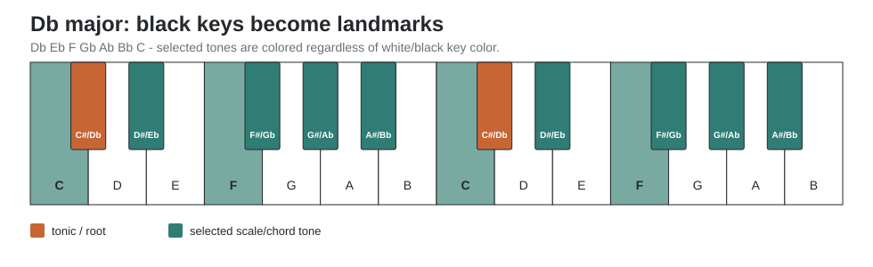

### Exercise 3 - Black-key rehabilitation

Play Db major slowly, one octave:

`Db Eb F Gb Ab Bb C Db`

Say degrees while playing:

`1 2 3 4 5 6 7 1`

Then play B major:

`B C# D# E F# G# A# B`

# Part II - Three geometries for the same music

## 4. Piano: non-isomorphic geometry

On piano, the same interval formula produces different visible shapes in different keys. Compare:

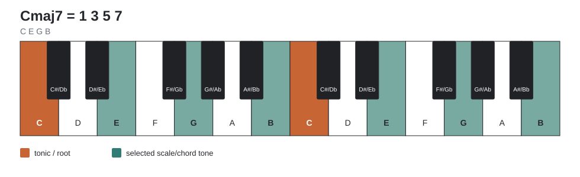

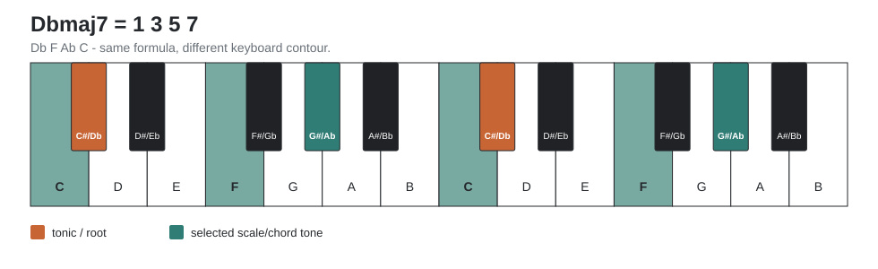

Both are `1 3 5 7`. The musical object is identical; only its keyboard realization changes.

## 5. Push: chromatic fourths as an isomorphic reference

For this manual, **Push is always treated in Chromatic mode**, never in a In-Key layout. Use the fourths layout unless an exercise explicitly says otherwise. In the common 12-tone chromatic fourths geometry, moving one pad to the right is one semitone and moving one pad upward is five semitones (a perfect fourth). A key/scale selection may still be useful for lighting scale tones, but pitches outside the scale remain physically present.

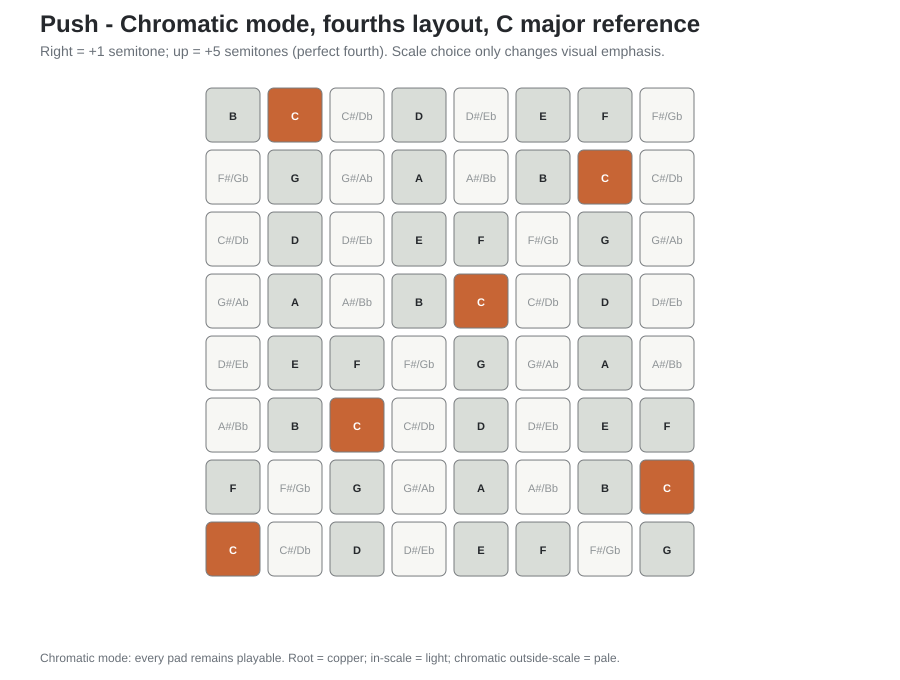

Now change the reference scale to F# Dorian **while remaining in Chromatic mode**. The important thing is that the pitch geometry stays chromatic while the visual emphasis changes.

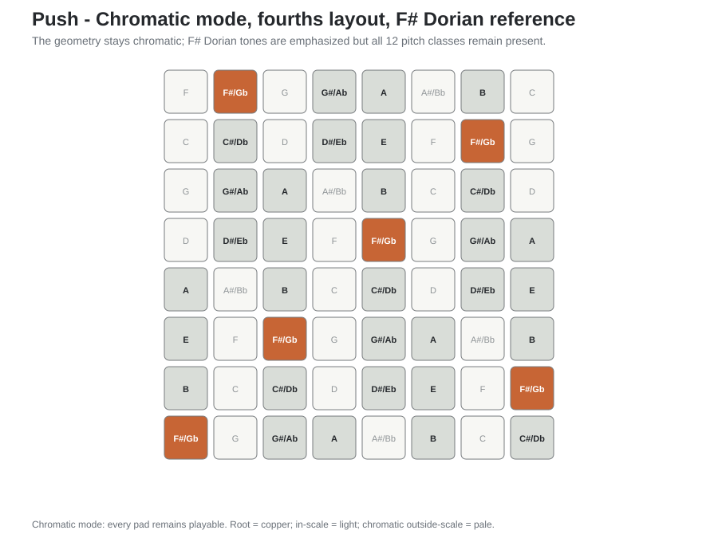

This makes Push a useful comparison instrument: it preserves a regular interval geometry, while piano forces the same interval formula into a varying white/black-key contour.

## 6. Ableton Note: chromatic pads with In Key off

Ableton Note's melodic pads can use Fourths or Sequential layouts. In this manual, keep **In Key OFF** so all twelve chromatic pitches remain playable. For direct comparison with guitar and Push, use **Fourths**: the pad directly above another is five semitones higher.

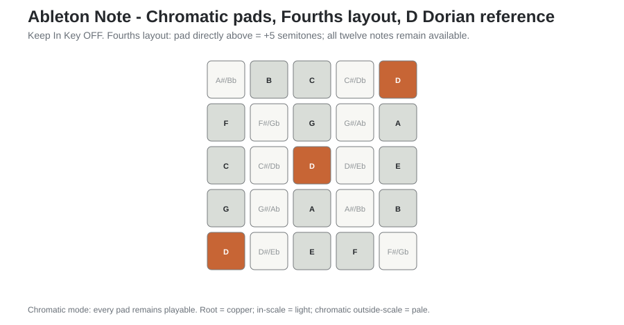

Use Note as a translation trainer: play an object on the chromatic pads, name its degree formula, then reproduce it on piano. The scale setting can act as a visual annotation, but it must not remove the chromatic notes you are trying to learn.

## 7. Guitar: mostly movable geometry

In standard tuning, every fret is a semitone. Most interval/chord shapes transpose by sliding, with one important irregularity: the interval between G and B strings is a major third rather than a perfect fourth.

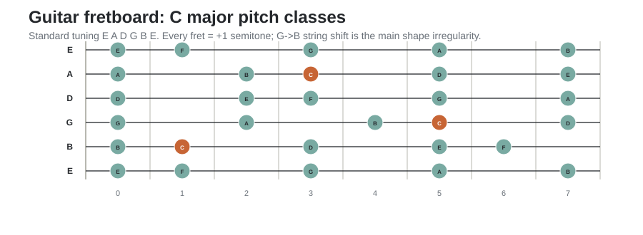

The piano problem is therefore the reverse of a barre chord: the *formula* transposes, but the *shape* does not.

### 7.1 Movable shapes hide pitch location

Movable geometry is useful, but it creates a specific blind spot. On guitar, a scale or chord can often be transposed by moving a familiar shape up or down the neck. The fingering relationship survives, but every sounding pitch has moved with it. A player can therefore know *how to move the object* without knowing which notes are sounding, or where the same pitch classes live in another register. Push and Note can encourage the same habit because their chromatic layouts are largely isomorphic.

Piano exposes the problem differently. Several keys can be practised in the same register: C major around middle C, Db major beginning a semitone higher, D major another semitone higher. The hand geometry changes, but the keyboard remains a fixed map of absolute pitches. This makes it easier to notice that transposition and relocation are not the same operation.

The book therefore treats **shape as a consequence, not as the musical object**. A shape is allowed to become automatic only after you can recover what it means: function, note names, register, and exact locations.

<strong>Fixed-register rule.</strong> When practising transposition on guitar, Push, or Note, do not always slide the same shape. Choose a register window first—for example C3–C5—and realize each scale or chord inside that window. Changing key will then force new strings, pads, inversions, or fingerings while keeping the sounding range comparable.

### Exercise 3A - One register, many geometries

Choose the register from C3 through C5. Play these major scales without leaving it:

1. C major
2. Db major
3. D major
4. Eb major
5. E major

On piano, name every note as you play it. On guitar or Push/Note, resist the urge to preserve one movable shape: choose positions that keep the pitches inside the same register window. Then reverse the exercise: keep a familiar shape and state explicitly how far the entire sounding register moved.

**Success criterion:** you can distinguish *transposing the musical relationship* from *moving a physical shape*, and you can name the exact pitches produced by either operation.

# Part III - Keys, scales, and modes

## 8. Major scale as the reference system

Major scale step pattern:

`W W H W W W H`

Degree formula:

`1 2 3 4 5 6 7`

A key is not a hand shape. It is a tonic plus an ordered pitch collection.

### The 12 practical major keys

| Major key | Notes | Relative minor |
| --- | --- | --- |
| C | C D E F G A B | Am |
| Db | Db Eb F Gb Ab Bb C | Bbm |
| D | D E F# G A B C# | Bm |
| Eb | Eb F G Ab Bb C D | Cm |
| E | E F# G# A B C# D# | C#m |
| F | F G A Bb C D E | Dm |
| F# | F# G# A# B C# D# E# | D#m |
| G | G A B C D E F# | Em |
| Ab | Ab Bb C Db Eb F G | Fm |
| A | A B C# D E F# G# | F#m |
| Bb | Bb C D Eb F G A | Gm |
| B | B C# D# E F# G# A# | G#m |

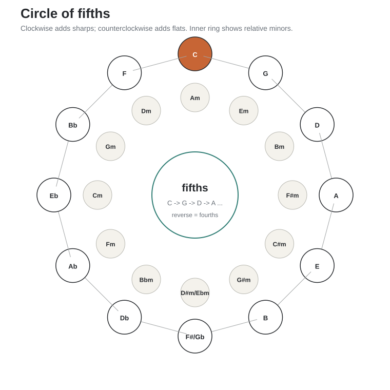

The circle is more than a key-signature mnemonic. Adjacent keys differ by only one scale pitch, so moving around it is a controlled way to acquire keyboard topography. Clockwise motion is a chain of ascending fifths; reading the same ring counterclockwise gives descending fifths / ascending fourths, which is why it also models much functional root motion.

### Exercise 4 - Circle-of-fifths acquisition

Learn major keys in this order:

`C → G → D → A → E → B → Gb/F# → Db → Ab → Eb → Bb → F`

For each key:

1. Say the seven notes.
2. Play one octave slowly.
3. Say degrees `1 2 3 4 5 6 7 1` while playing.
4. Build `1-3-5`, then `1-3-5-7`.
5. Arpeggiate them.
6. Play the same key on Push/Note.
7. Find the tonic and scale tones on guitar.

Do not add speed until the note names are reliable.

## 9. The seven diatonic modes

The modes are not seven unrelated scales. They are seven rotations / alterations of a diatonic collection, best understood as degree formulas relative to a new tonic.

| Mode | Formula | Characteristic degree |
| --- | --- | --- |
| Ionian | `1 2 3 4 5 6 7` | major 7 |
| Dorian | `1 2 b3 4 5 6 b7` | natural 6 over minor |
| Phrygian | `1 b2 b3 4 5 b6 b7` | b2 |
| Lydian | `1 2 3 #4 5 6 7` | #4 |
| Mixolydian | `1 2 3 4 5 6 b7` | b7 over major |
| Aeolian | `1 2 b3 4 5 b6 b7` | b6 |
| Locrian | `1 b2 b3 4 b5 b6 b7` | b5 |

### Exercise 5 - Break the white-key trap

If C major, A minor, and D Dorian are your default universe, they all use the same pitch collection. Deliberately practice modes whose tonic forces black keys:

- Eb Dorian: `Eb F Gb Ab Bb C Db`
- F# Dorian: `F# G# A B C# D# E`
- Db Lydian: `Db Eb F G Ab Bb C`
- Ab Mixolydian: `Ab Bb C Db Eb F Gb`

For each, alternate between:

`scale → triad → seventh chord → arpeggio → 2-bar improvisation`

## 10. Common non-diatonic scales

Harmonic minor introduces a leading tone into natural minor. Melodic minor (jazz usage) raises 6 and 7. Pentatonic and blues scales simplify the pitch set for melodic practice. Whole tone removes semitone hierarchy and produces symmetrical augmented harmony.

| Scale | Formula | Typical use |
| --- | --- | --- |
| Harmonic minor | `1 2 b3 4 5 b6 7` | minor-key dominant function |
| Melodic minor | `1 2 b3 4 5 6 7` | jazz minor, altered modal harmony |
| Major pentatonic | `1 2 3 5 6` | consonant melody |
| Minor pentatonic | `1 b3 4 5 b7` | rock, blues, modal melody |
| Minor blues | `1 b3 4 b5 5 b7` | blues vocabulary |
| Whole tone | `1 2 3 #4 #5 b7` | symmetrical / augmented sound |

# Part IV - Chords, inversions, voicings, and arpeggios

## 11. Chords are formulas

Read a chord symbol from left to right: **root letter → chord quality → extensions or alterations**. For example, `Abmaj9` means an Ab-root chord with major quality, a major seventh, and a ninth.

### 11.1 The circle of thirds: the geometry inside tertian chords

In a diatonic key, reorder the seven scale degrees as:

`1 → 3 → 5 → 7 → 2 → 4 → 6 → 1`

In C major this is `C → E → G → B → D → F → A → C`. Three adjacent positions give a triad; four give a seventh chord. Unlike the circle of fifths, this **diatonic circle of thirds depends on the key** because the sequence uses scale notes rather than a fixed chromatic interval.

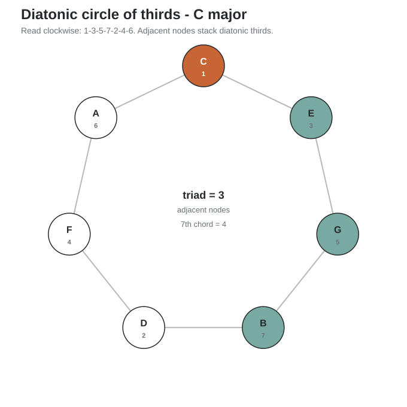

There are also chromatic cycles made from a constant major or minor third. They are symmetrical subsets of the 12-note system: major thirds close after three steps, minor thirds after four. These cycles explain augmented and diminished symmetry and are useful when you later explore chromatic harmony.

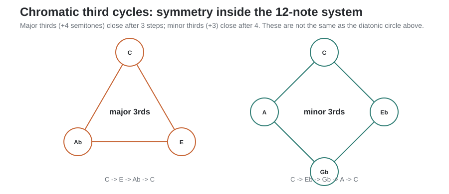

### 11.2 Core chord formulas

### Core triads

| Chord | Formula | C example |
| --- | --- | --- |
| Major | `1 3 5` | C E G |
| Minor | `1 b3 5` | C Eb G |
| Diminished | `1 b3 b5` | C Eb Gb |
| Augmented | `1 3 #5` | C E G# |
| sus2 | `1 2 5` | C D G |
| sus4 | `1 4 5` | C F G |

### Seventh chords

| Chord | Formula | C example |
| --- | --- | --- |
| maj7 | `1 3 5 7` | C E G B |
| 7 | `1 3 5 b7` | C E G Bb |
| m7 | `1 b3 5 b7` | C Eb G Bb |
| m(maj7) | `1 b3 5 7` | C Eb G B |
| m7b5 | `1 b3 b5 b7` | C Eb Gb Bb |
| dim7 | `1 b3 b5 bb7` | C Eb Gb Bbb |

## 12. Inversions

A chord inversion changes which chord tone is in the bass without changing chord identity.

For Cmaj7:

- Root position: `C E G B` = `1 3 5 7`
- 1st inversion: `E G B C` = `3 5 7 1`
- 2nd inversion: `G B C E` = `5 7 1 3`
- 3rd inversion: `B C E G` = `7 1 3 5`

### Exercise 6 - One chord, twelve roots, four inversions

Take `m7 = 1 b3 5 b7`.

1. Build Cm7.
2. Play all four inversions.
3. Move the root chromatically to Db, D, Eb ... B.
4. At each root, say the four note names before playing.
5. Then reverse: hear or imagine a voicing and identify its degree order.

## 13. Piano voicing families

A **voicing** is a choice of register, doubling, omission, and spacing for a chord. This is where pitch-class knowledge becomes exact pitch knowledge: `C E G B` names chord tones; `C3 E3 G3 B3` names one concrete realization.

### 13.1 Close position

Keep chord tones within one octave. Best for learning spelling and inversions.

`Cmaj7: C E G B`

### 13.2 Open / spread position

Move one or more inner tones by an octave.

`Cmaj7: C G B E`

This creates more air and reduces midrange congestion.

### 13.3 Shell voicings

For jazz/pop accompaniment, the 3rd and 7th carry much of the harmonic identity.

- Cmaj7 shell: `C E B` or `C B E`
- C7 shell: `C E Bb`
- Cm7 shell: `C Eb Bb`

### 13.4 Rootless guide-tone voicings

When bass supplies the root, omit it and voice color tones.

For a ii-V-I in C:

- Dm7: `F A C E` = `b3 5 b7 9`
- G7: `F A B E` = `b7 9 3 13`
- Cmaj7: `E G B D` = `3 5 7 9`

The important feature is voice leading: individual notes move by small intervals.

### 13.5 Quartal voicings

Stack fourths rather than thirds. In D Dorian, a simple voicing is:

`D G C F` = `1 4 b7 b3`

Quartal harmony is especially natural on guitar and fourths-based pad layouts.

### 13.6 Drop-2 concept

Take a four-note close voicing, number voices from the top, and move the second-highest voice down an octave. This produces a wider four-note texture common in arranging and guitar voicings.

Example Cmaj7 close: `C E G B`. From the top: B(1), G(2), E(3), C(4). Drop G down an octave: `G C E B`.

## 14. Extensions

Extensions continue tertian stacking beyond the seventh:

- 9 = scale degree 2 above the octave
- 11 = scale degree 4 above the octave
- 13 = scale degree 6 above the octave

Chord symbols usually imply selective voicing, not every possible chord tone.

| Chord | Useful formula | C example |
| --- | --- | --- |
| maj9 | `1 3 5 7 9` | C E G B D |
| 9 | `1 3 5 b7 9` | C E G Bb D |
| m9 | `1 b3 5 b7 9` | C Eb G Bb D |
| 6 | `1 3 5 6` | C E G A |
| m6 | `1 b3 5 6` | C Eb G A |
| 7sus4 | `1 4 5 b7` | C F G Bb |

For practical keyboard voicing, the 5th is often omitted before the 3rd or 7th.

## 15. Arpeggios are chords unfolded in time

Do not learn arpeggios as an unrelated technique. Use the chord vocabulary you are already learning.

### Exercise 7 - Arpeggio compiler

For each root, play:

1. `maj7`: `1 3 5 7 1 7 5 3 1`
2. `m7`: `1 b3 5 b7 1 b7 5 b3 1`
3. `7`: `1 3 5 b7 1 b7 5 3 1`
4. `m7b5`: `1 b3 b5 b7 1 b7 b5 b3 1`

Start with one octave. Then use two octaves and choose fingerings that minimize twisting. At speed, consult conventional piano fingering and keep thumbs mostly on white keys where practical.

# Part V - Transposition as a systematic skill

## 16. The translation pipeline

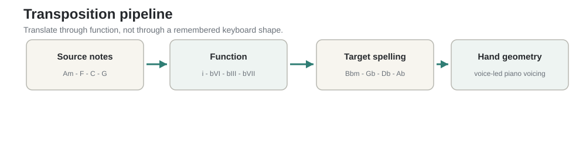

When transposing, do not translate hand shape to hand shape. Translate through function and then make register explicit:

`source notes → degree formula → target pitch classes → register → target geometry`

Example:

`Am - F - C - G`

In A minor this is:

`i - bVI - bIII - bVII`

Move the function to Bb minor:

`Bbm - Gb - Db - Ab`

The formula survives unchanged.

### Exercise 8 - Functional progression through all 12 roots

Pick one progression and cycle through roots chromatically. Do not use a transpose button on the piano.

Suggested first progression:

`i - bVI - bIII - bVII`

Then:

- `I - V - vi - IV`
- `ii - V - I`
- `I - vi - IV - V`
- `i - iv - V7 - i`

## 17. ii-V-I and voice leading

The `ii-V-I` progression means a minor chord on scale degree 2, a dominant-function chord on degree 5, and the tonic chord on degree 1. It is a compact laboratory for functional harmony and economical piano movement.

In C major:

`Dm7 → G7 → Cmaj7`

Try close positions first, then minimize movement. Track each voice independently. The goal is not identical shapes but small voice-leading distances.

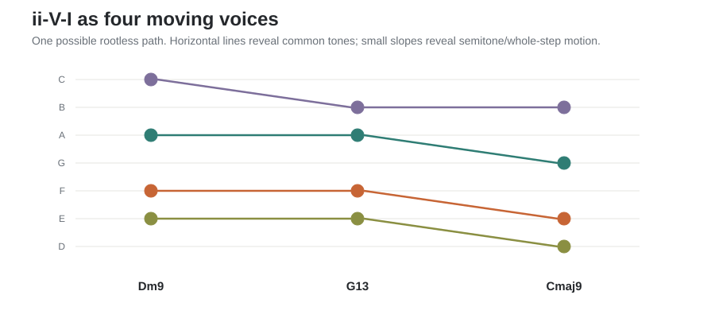

The graph is not a required voicing; it is a way to **see** why a good voicing feels economical. Repeated horizontal levels are common tones; shallow slopes are small interval moves.

## 18. Transposition between Push/Note and piano

Use the isomorphic controller as the abstract reference and piano as the concrete realization.

### Exercise 9 - Controller-to-piano translation loop

1. Select a reference key and mode on Push or Note, but keep Push in **Chromatic** mode and Note **In Key OFF**.
2. Play a 3- or 4-note chord shape.
3. Name its degrees relative to the root.
4. Change the reference key on the controller while keeping the chromatic/fourths geometry available.
5. Say the new note names.
6. Reproduce them on piano.
7. Repeat in a key with several black notes.

Example:

- D Dorian degrees: `1 b3 5 b7` → `D F A C`
- F# Dorian same degrees → `F# A C# E`

## 19. Transposition between guitar and piano

A guitar position is not a key. The same pitch class appears at several string/fret locations, and a movable shape normally changes register as it moves. The aim is not to stop using shapes, but to be able to enter and leave them deliberately.

### Exercise 10 - Barre-shape decomposition

Take a movable guitar chord shape you know well.

1. Name the chord quality.
2. Write its formula.
3. Play it at three roots on guitar.
4. For each root, spell the notes.
5. State the lowest and highest sounding pitch, including octave numbers.
6. Build those exact pitches on piano.
7. Rebuild the same chord quality on piano in the *same register* after changing root.
8. Return to guitar and find a different fingering that matches the piano register rather than the original movable shape.

This converts geometric guitar intuition into harmonic-function and pitch-location intuition rather than discarding it.

# Part VI - Practice programs

## 20. 20-minute transposition routine

| Time | Task | Rule |
| ---: | --- | --- |
| 5 min | One scale/mode in all 12 roots | Say degrees and note names |
| 5 min | One chord quality in all 12 roots | Root position + inversions |
| 5 min | Arpeggiate the same chord | Slow, even, relaxed |
| 5 min | One real progression in all 12 roots | Functional analysis first |

Start the session in a non-white-key tonic such as Db, Eb, F#, or Ab at least half the time.

## 21. Eight-week curriculum - beginner track

### Week 1 - Keyboard map and semitones
- Find C and F from black-key groups.
- Learn note names.
- Play chromatic steps.
- Learn finger numbers 1-5 (thumb to little finger).
- Build perfect fifths from random roots.

### Week 2 - Major scale and triads
- C, G, D, F major.
- Build `1 3 5` and `1 b3 5` from each tonic.
- Hear major vs minor quality.

### Week 3 - All major keys, slowly
- Add A, E, B, Db, Gb, Ab, Eb, Bb.
- One octave only.
- Say notes before playing.

### Week 4 - Seventh chords
- maj7, 7, m7.
- Root position and first inversion.
- Simple I-IV-V and ii-V-I progressions.

### Week 5 - Minor and Dorian
- Natural minor in all roots.
- Dorian in four roots with black keys.
- Compare Aeolian b6 vs Dorian natural 6.

### Week 6 - Inversions and voice leading
- All inversions of major/minor triads.
- Nearest inversion when changing chords.
- Keep common tones under the same finger when possible.

### Week 7 - Arpeggios and accompaniment
- Broken triads and sevenths.
- Left-hand root + right-hand chord.
- Then left-hand shell + right-hand melody.

### Week 8 - Transpose actual music
- Choose two songs/progressions.
- Analyze degrees.
- Play in at least six keys, then all twelve.
- Record one version on piano and one on Push/Note.

## 22. Eight-week curriculum - experienced guitarist / producer track

### Week 1 - Destroy the C-major dependency
Every practice item begins on Db, F#, Ab, or B. Major, Dorian, m7, maj7, dominant 7. Keep at least half of the work inside one fixed two-octave register window so transposition cannot be reduced to sliding a shape.

### Week 2 - Chord compiler
One chord formula per day through all 12 roots; all inversions.

### Week 3 - Modal compiler
Dorian, Mixolydian, Lydian, Aeolian through all 12 roots. Improvise two bars per root.

### Week 4 - ii-V-I
All 12 major keys. First root-position spellings, then economical inversions, then shells/rootless voicings.

### Week 5 - Minor harmony
Natural/harmonic/melodic minor. `i-iv-V7-i` in all 12 roots. Hear the leading tone created by harmonic minor.

### Week 6 - Cross-controller translation
Push/Note → degree formula → pitch names + register → piano. Guitar → degree formula → pitch names + register → piano. No direct visual copying.

### Week 7 - Voicing families
Close, spread, shells, rootless guide tones, quartal, drop-2. Transpose one voicing family through all roots.

### Week 8 - Repertoire stress test
Choose your own material that normally lands in A minor / D Dorian / C major. Force it into Db, E, F#, Ab, and Bb before returning to its original key.

## 23. Tempo and accuracy protocol

Use a metronome only after note selection is correct.

1. Begin without pulse: correct notes, relaxed hands.
2. Use 50-60 bpm, one note per beat.
3. Increase only after three error-free repetitions.
4. If an error appears twice, reduce tempo by 10-15%.
5. For transposition drills, cognitive speed matters more than finger speed: say the target notes before playing.

## 24. What to memorize vs what to derive

Memorize:

- note names on piano, including octave/register landmarks
- semitone distances of core intervals
- scale-degree formulas
- chord formulas
- major key spellings
- tactile location of black-key groups

Derive initially, then allow motor memory to take over:

- each chord's piano geometry
- each scale's physical contour
- alternate guitar/controller realizations of the same pitches in a fixed register
- inversions in every key
- efficient voice leading

Do **not** memorize twelve unrelated pictures if one formula explains them.

# Part VII - Compact reference

## 25. Circle of fifths quick reference

| Key | Sharps/flats | Relative minor |
| --- | --- | --- |
| C | none | Am |
| G | F# | Em |
| D | F#, C# | Bm |
| A | F#, C#, G# | F#m |
| E | F#, C#, G#, D# | C#m |
| B | F#, C#, G#, D#, A# | G#m |
| Gb | Bb, Eb, Ab, Db, Gb, Cb | Ebm |
| Db | Bb, Eb, Ab, Db, Gb | Bbm |
| Ab | Bb, Eb, Ab, Db | Fm |
| Eb | Bb, Eb, Ab | Cm |
| Bb | Bb, Eb | Gm |
| F | Bb | Dm |

## 26. Circles of thirds quick reference

**Diatonic circle of thirds:** `1-3-5-7-2-4-6`. Use it to spell tertian chords inside any key. A triad is three adjacent entries; a seventh chord is four.

**Chromatic major-third cycles:** +4 semitones; three notes per cycle. Example: `C-E-Ab-C`.

**Chromatic minor-third cycles:** +3 semitones; four notes per cycle. Example: `C-Eb-Gb-A-C`.

## 27. Diatonic seventh-chord qualities by mode degree

For a major key:

`Imaj7 - iim7 - iiim7 - IVmaj7 - V7 - vim7 - viim7b5`

This pattern transposes intact to every major key.

## 28. Chord-scale degree priorities

For recognizing harmony quickly:

- 3rd tells major vs minor.
- 7th tells maj7 vs dominant/minor family.
- 5th tells perfect vs diminished/augmented.
- 9/11/13 add color after identity is established.

## 29. Suggested voicing workflow for a new chord symbol

Given `Abmaj9`:

1. Root: Ab.
2. Formula: `1 3 5 7 9`.
3. Spell: `Ab C Eb G Bb`.
4. First piano realization: close or comfortable spread.
5. If bass covers root: omit Ab.
6. If texture is muddy: omit 5 (Eb) before omitting 3 or 7.
7. Choose inversion that creates the smoothest path from the previous chord.

# Appendix A - All seven modes in all 12 practical roots

### Major (Ionian)

| Root | Degree formula | Notes |
| --- | --- | --- |
| C | 1 2 3 4 5 6 7 | C D E F G A B |
| Db | 1 2 3 4 5 6 7 | Db Eb F Gb Ab Bb C |
| D | 1 2 3 4 5 6 7 | D E F# G A B C# |
| Eb | 1 2 3 4 5 6 7 | Eb F G Ab Bb C D |
| E | 1 2 3 4 5 6 7 | E F# G# A B C# D# |
| F | 1 2 3 4 5 6 7 | F G A Bb C D E |
| F# | 1 2 3 4 5 6 7 | F# G# A# B C# D# E# |
| G | 1 2 3 4 5 6 7 | G A B C D E F# |
| Ab | 1 2 3 4 5 6 7 | Ab Bb C Db Eb F G |
| A | 1 2 3 4 5 6 7 | A B C# D E F# G# |
| Bb | 1 2 3 4 5 6 7 | Bb C D Eb F G A |
| B | 1 2 3 4 5 6 7 | B C# D# E F# G# A# |

### Dorian

| Root | Degree formula | Notes |
| --- | --- | --- |
| C | 1 2 b3 4 5 6 b7 | C D Eb F G A Bb |
| Db | 1 2 b3 4 5 6 b7 | Db Eb Fb Gb Ab Bb Cb |
| D | 1 2 b3 4 5 6 b7 | D E F G A B C |
| Eb | 1 2 b3 4 5 6 b7 | Eb F Gb Ab Bb C Db |
| E | 1 2 b3 4 5 6 b7 | E F# G A B C# D |
| F | 1 2 b3 4 5 6 b7 | F G Ab Bb C D Eb |
| F# | 1 2 b3 4 5 6 b7 | F# G# A B C# D# E |
| G | 1 2 b3 4 5 6 b7 | G A Bb C D E F |
| Ab | 1 2 b3 4 5 6 b7 | Ab Bb Cb Db Eb F Gb |
| A | 1 2 b3 4 5 6 b7 | A B C D E F# G |
| Bb | 1 2 b3 4 5 6 b7 | Bb C Db Eb F G Ab |
| B | 1 2 b3 4 5 6 b7 | B C# D E F# G# A |

### Phrygian

| Root | Degree formula | Notes |
| --- | --- | --- |
| C | 1 b2 b3 4 5 b6 b7 | C Db Eb F G Ab Bb |
| Db | 1 b2 b3 4 5 b6 b7 | Db Ebb Fb Gb Ab Bbb Cb |
| D | 1 b2 b3 4 5 b6 b7 | D Eb F G A Bb C |
| Eb | 1 b2 b3 4 5 b6 b7 | Eb Fb Gb Ab Bb Cb Db |
| E | 1 b2 b3 4 5 b6 b7 | E F G A B C D |
| F | 1 b2 b3 4 5 b6 b7 | F Gb Ab Bb C Db Eb |
| F# | 1 b2 b3 4 5 b6 b7 | F# G A B C# D E |
| G | 1 b2 b3 4 5 b6 b7 | G Ab Bb C D Eb F |
| Ab | 1 b2 b3 4 5 b6 b7 | Ab Bbb Cb Db Eb Fb Gb |
| A | 1 b2 b3 4 5 b6 b7 | A Bb C D E F G |
| Bb | 1 b2 b3 4 5 b6 b7 | Bb Cb Db Eb F Gb Ab |
| B | 1 b2 b3 4 5 b6 b7 | B C D E F# G A |

### Lydian

| Root | Degree formula | Notes |
| --- | --- | --- |
| C | 1 2 3 #4 5 6 7 | C D E F# G A B |
| Db | 1 2 3 #4 5 6 7 | Db Eb F G Ab Bb C |
| D | 1 2 3 #4 5 6 7 | D E F# G# A B C# |
| Eb | 1 2 3 #4 5 6 7 | Eb F G A Bb C D |
| E | 1 2 3 #4 5 6 7 | E F# G# A# B C# D# |
| F | 1 2 3 #4 5 6 7 | F G A B C D E |
| F# | 1 2 3 #4 5 6 7 | F# G# A# B# C# D# E# |
| G | 1 2 3 #4 5 6 7 | G A B C# D E F# |
| Ab | 1 2 3 #4 5 6 7 | Ab Bb C D Eb F G |
| A | 1 2 3 #4 5 6 7 | A B C# D# E F# G# |
| Bb | 1 2 3 #4 5 6 7 | Bb C D E F G A |
| B | 1 2 3 #4 5 6 7 | B C# D# E# F# G# A# |

### Mixolydian

| Root | Degree formula | Notes |
| --- | --- | --- |
| C | 1 2 3 4 5 6 b7 | C D E F G A Bb |
| Db | 1 2 3 4 5 6 b7 | Db Eb F Gb Ab Bb Cb |
| D | 1 2 3 4 5 6 b7 | D E F# G A B C |
| Eb | 1 2 3 4 5 6 b7 | Eb F G Ab Bb C Db |
| E | 1 2 3 4 5 6 b7 | E F# G# A B C# D |
| F | 1 2 3 4 5 6 b7 | F G A Bb C D Eb |
| F# | 1 2 3 4 5 6 b7 | F# G# A# B C# D# E |
| G | 1 2 3 4 5 6 b7 | G A B C D E F |
| Ab | 1 2 3 4 5 6 b7 | Ab Bb C Db Eb F Gb |
| A | 1 2 3 4 5 6 b7 | A B C# D E F# G |
| Bb | 1 2 3 4 5 6 b7 | Bb C D Eb F G Ab |
| B | 1 2 3 4 5 6 b7 | B C# D# E F# G# A |

### Natural minor (Aeolian)

| Root | Degree formula | Notes |
| --- | --- | --- |
| C | 1 2 b3 4 5 b6 b7 | C D Eb F G Ab Bb |
| Db | 1 2 b3 4 5 b6 b7 | Db Eb Fb Gb Ab Bbb Cb |
| D | 1 2 b3 4 5 b6 b7 | D E F G A Bb C |
| Eb | 1 2 b3 4 5 b6 b7 | Eb F Gb Ab Bb Cb Db |
| E | 1 2 b3 4 5 b6 b7 | E F# G A B C D |
| F | 1 2 b3 4 5 b6 b7 | F G Ab Bb C Db Eb |
| F# | 1 2 b3 4 5 b6 b7 | F# G# A B C# D E |
| G | 1 2 b3 4 5 b6 b7 | G A Bb C D Eb F |
| Ab | 1 2 b3 4 5 b6 b7 | Ab Bb Cb Db Eb Fb Gb |
| A | 1 2 b3 4 5 b6 b7 | A B C D E F G |
| Bb | 1 2 b3 4 5 b6 b7 | Bb C Db Eb F Gb Ab |
| B | 1 2 b3 4 5 b6 b7 | B C# D E F# G A |

### Locrian

| Root | Degree formula | Notes |
| --- | --- | --- |
| C | 1 b2 b3 4 b5 b6 b7 | C Db Eb F Gb Ab Bb |
| Db | 1 b2 b3 4 b5 b6 b7 | Db Ebb Fb Gb Abb Bbb Cb |
| D | 1 b2 b3 4 b5 b6 b7 | D Eb F G Ab Bb C |
| Eb | 1 b2 b3 4 b5 b6 b7 | Eb Fb Gb Ab Bbb Cb Db |
| E | 1 b2 b3 4 b5 b6 b7 | E F G A Bb C D |
| F | 1 b2 b3 4 b5 b6 b7 | F Gb Ab Bb Cb Db Eb |
| F# | 1 b2 b3 4 b5 b6 b7 | F# G A B C D E |
| G | 1 b2 b3 4 b5 b6 b7 | G Ab Bb C Db Eb F |
| Ab | 1 b2 b3 4 b5 b6 b7 | Ab Bbb Cb Db Ebb Fb Gb |
| A | 1 b2 b3 4 b5 b6 b7 | A Bb C D Eb F G |
| Bb | 1 b2 b3 4 b5 b6 b7 | Bb Cb Db Eb Fb Gb Ab |
| B | 1 b2 b3 4 b5 b6 b7 | B C D E F G A |

# Appendix B - Common scales in all 12 roots

### Major (Ionian)

| Root | Degree formula | Notes |
| --- | --- | --- |
| C | 1 2 3 4 5 6 7 | C D E F G A B |
| Db | 1 2 3 4 5 6 7 | Db Eb F Gb Ab Bb C |
| D | 1 2 3 4 5 6 7 | D E F# G A B C# |
| Eb | 1 2 3 4 5 6 7 | Eb F G Ab Bb C D |
| E | 1 2 3 4 5 6 7 | E F# G# A B C# D# |
| F | 1 2 3 4 5 6 7 | F G A Bb C D E |
| F# | 1 2 3 4 5 6 7 | F# G# A# B C# D# E# |
| G | 1 2 3 4 5 6 7 | G A B C D E F# |
| Ab | 1 2 3 4 5 6 7 | Ab Bb C Db Eb F G |
| A | 1 2 3 4 5 6 7 | A B C# D E F# G# |
| Bb | 1 2 3 4 5 6 7 | Bb C D Eb F G A |
| B | 1 2 3 4 5 6 7 | B C# D# E F# G# A# |

### Natural minor (Aeolian)

| Root | Degree formula | Notes |
| --- | --- | --- |
| C | 1 2 b3 4 5 b6 b7 | C D Eb F G Ab Bb |
| Db | 1 2 b3 4 5 b6 b7 | Db Eb Fb Gb Ab Bbb Cb |
| D | 1 2 b3 4 5 b6 b7 | D E F G A Bb C |
| Eb | 1 2 b3 4 5 b6 b7 | Eb F Gb Ab Bb Cb Db |
| E | 1 2 b3 4 5 b6 b7 | E F# G A B C D |
| F | 1 2 b3 4 5 b6 b7 | F G Ab Bb C Db Eb |
| F# | 1 2 b3 4 5 b6 b7 | F# G# A B C# D E |
| G | 1 2 b3 4 5 b6 b7 | G A Bb C D Eb F |
| Ab | 1 2 b3 4 5 b6 b7 | Ab Bb Cb Db Eb Fb Gb |
| A | 1 2 b3 4 5 b6 b7 | A B C D E F G |
| Bb | 1 2 b3 4 5 b6 b7 | Bb C Db Eb F Gb Ab |
| B | 1 2 b3 4 5 b6 b7 | B C# D E F# G A |

### Harmonic minor

| Root | Degree formula | Notes |
| --- | --- | --- |
| C | 1 2 b3 4 5 b6 7 | C D Eb F G Ab B |
| Db | 1 2 b3 4 5 b6 7 | Db Eb Fb Gb Ab Bbb C |
| D | 1 2 b3 4 5 b6 7 | D E F G A Bb C# |
| Eb | 1 2 b3 4 5 b6 7 | Eb F Gb Ab Bb Cb D |
| E | 1 2 b3 4 5 b6 7 | E F# G A B C D# |
| F | 1 2 b3 4 5 b6 7 | F G Ab Bb C Db E |
| F# | 1 2 b3 4 5 b6 7 | F# G# A B C# D E# |
| G | 1 2 b3 4 5 b6 7 | G A Bb C D Eb F# |
| Ab | 1 2 b3 4 5 b6 7 | Ab Bb Cb Db Eb Fb G |
| A | 1 2 b3 4 5 b6 7 | A B C D E F G# |
| Bb | 1 2 b3 4 5 b6 7 | Bb C Db Eb F Gb A |
| B | 1 2 b3 4 5 b6 7 | B C# D E F# G A# |

### Melodic minor (ascending)

| Root | Degree formula | Notes |
| --- | --- | --- |
| C | 1 2 b3 4 5 6 7 | C D Eb F G A B |
| Db | 1 2 b3 4 5 6 7 | Db Eb Fb Gb Ab Bb C |
| D | 1 2 b3 4 5 6 7 | D E F G A B C# |
| Eb | 1 2 b3 4 5 6 7 | Eb F Gb Ab Bb C D |
| E | 1 2 b3 4 5 6 7 | E F# G A B C# D# |
| F | 1 2 b3 4 5 6 7 | F G Ab Bb C D E |
| F# | 1 2 b3 4 5 6 7 | F# G# A B C# D# E# |
| G | 1 2 b3 4 5 6 7 | G A Bb C D E F# |
| Ab | 1 2 b3 4 5 6 7 | Ab Bb Cb Db Eb F G |
| A | 1 2 b3 4 5 6 7 | A B C D E F# G# |
| Bb | 1 2 b3 4 5 6 7 | Bb C Db Eb F G A |
| B | 1 2 b3 4 5 6 7 | B C# D E F# G# A# |

### Major pentatonic

| Root | Degree formula | Notes |
| --- | --- | --- |
| C | 1 2 3 5 6 | C D E G A |
| Db | 1 2 3 5 6 | Db Eb F Ab Bb |
| D | 1 2 3 5 6 | D E F# A B |
| Eb | 1 2 3 5 6 | Eb F G Bb C |
| E | 1 2 3 5 6 | E F# G# B C# |
| F | 1 2 3 5 6 | F G A C D |
| F# | 1 2 3 5 6 | F# G# A# C# D# |
| G | 1 2 3 5 6 | G A B D E |
| Ab | 1 2 3 5 6 | Ab Bb C Eb F |
| A | 1 2 3 5 6 | A B C# E F# |
| Bb | 1 2 3 5 6 | Bb C D F G |
| B | 1 2 3 5 6 | B C# D# F# G# |

### Minor pentatonic

| Root | Degree formula | Notes |
| --- | --- | --- |
| C | 1 b3 4 5 b7 | C Eb F G Bb |
| Db | 1 b3 4 5 b7 | Db Fb Gb Ab Cb |
| D | 1 b3 4 5 b7 | D F G A C |
| Eb | 1 b3 4 5 b7 | Eb Gb Ab Bb Db |
| E | 1 b3 4 5 b7 | E G A B D |
| F | 1 b3 4 5 b7 | F Ab Bb C Eb |
| F# | 1 b3 4 5 b7 | F# A B C# E |
| G | 1 b3 4 5 b7 | G Bb C D F |
| Ab | 1 b3 4 5 b7 | Ab Cb Db Eb Gb |
| A | 1 b3 4 5 b7 | A C D E G |
| Bb | 1 b3 4 5 b7 | Bb Db Eb F Ab |
| B | 1 b3 4 5 b7 | B D E F# A |

### Minor blues

| Root | Degree formula | Notes |
| --- | --- | --- |
| C | 1 b3 4 b5 5 b7 | C Eb F Gb G Bb |
| Db | 1 b3 4 b5 5 b7 | Db Fb Gb Abb Ab Cb |
| D | 1 b3 4 b5 5 b7 | D F G Ab A C |
| Eb | 1 b3 4 b5 5 b7 | Eb Gb Ab Bbb Bb Db |
| E | 1 b3 4 b5 5 b7 | E G A Bb B D |
| F | 1 b3 4 b5 5 b7 | F Ab Bb Cb C Eb |
| F# | 1 b3 4 b5 5 b7 | F# A B C C# E |
| G | 1 b3 4 b5 5 b7 | G Bb C Db D F |
| Ab | 1 b3 4 b5 5 b7 | Ab Cb Db Ebb Eb Gb |
| A | 1 b3 4 b5 5 b7 | A C D Eb E G |
| Bb | 1 b3 4 b5 5 b7 | Bb Db Eb Fb F Ab |
| B | 1 b3 4 b5 5 b7 | B D E F F# A |

### Whole tone

| Root | Degree formula | Notes |
| --- | --- | --- |
| C | 1 2 3 #4 #5 b7 | C D E F# G# A# |
| Db | 1 2 3 #4 #5 b7 | Db Eb F G A B |
| D | 1 2 3 #4 #5 b7 | D E F# G# A# B# |
| Eb | 1 2 3 #4 #5 b7 | Eb F G A B C# |
| E | 1 2 3 #4 #5 b7 | E F# G# A# B# C## |
| F | 1 2 3 #4 #5 b7 | F G A B C# D# |
| F# | 1 2 3 #4 #5 b7 | F# G# A# B# C## D## |
| G | 1 2 3 #4 #5 b7 | G A B C# D# E# |
| Ab | 1 2 3 #4 #5 b7 | Ab Bb C D E F# |
| A | 1 2 3 #4 #5 b7 | A B C# D# E# F## |
| Bb | 1 2 3 #4 #5 b7 | Bb C D E F# G# |
| B | 1 2 3 #4 #5 b7 | B C# D# E# F## G## |

# Appendix C - Chord spelling tables

## Triads in all 12 roots

| Root | Major triad | Minor triad | Diminished triad | Augmented triad |
| --- | --- | --- | --- | --- |
| C | C E G | C Eb G | C Eb Gb | C E G# |
| Db | Db F Ab | Db Fb Ab | Db Fb Abb | Db F A |
| D | D F# A | D F A | D F Ab | D F# A# |
| Eb | Eb G Bb | Eb Gb Bb | Eb Gb Bbb | Eb G B |
| E | E G# B | E G B | E G Bb | E G# B# |
| F | F A C | F Ab C | F Ab Cb | F A C# |
| F# | F# A# C# | F# A C# | F# A C | F# A# C## |
| G | G B D | G Bb D | G Bb Db | G B D# |
| Ab | Ab C Eb | Ab Cb Eb | Ab Cb Ebb | Ab C E |
| A | A C# E | A C E | A C Eb | A C# E# |
| Bb | Bb D F | Bb Db F | Bb Db Fb | Bb D F# |
| B | B D# F# | B D F# | B D F | B D# F## |

## Seventh chords in all 12 roots

| Root | Major 7 | Dominant 7 | Minor 7 | Half-diminished 7 | Diminished 7 |
| --- | --- | --- | --- | --- | --- |
| C | C E G B | C E G Bb | C Eb G Bb | C Eb Gb Bb | C Eb Gb Bbb |
| Db | Db F Ab C | Db F Ab Cb | Db Fb Ab Cb | Db Fb Abb Cb | Db Fb Abb Cbb |
| D | D F# A C# | D F# A C | D F A C | D F Ab C | D F Ab Cb |
| Eb | Eb G Bb D | Eb G Bb Db | Eb Gb Bb Db | Eb Gb Bbb Db | Eb Gb Bbb Dbb |
| E | E G# B D# | E G# B D | E G B D | E G Bb D | E G Bb Db |
| F | F A C E | F A C Eb | F Ab C Eb | F Ab Cb Eb | F Ab Cb Ebb |
| F# | F# A# C# E# | F# A# C# E | F# A C# E | F# A C E | F# A C Eb |
| G | G B D F# | G B D F | G Bb D F | G Bb Db F | G Bb Db Fb |
| Ab | Ab C Eb G | Ab C Eb Gb | Ab Cb Eb Gb | Ab Cb Ebb Gb | Ab Cb Ebb Gbb |
| A | A C# E G# | A C# E G | A C E G | A C Eb G | A C Eb Gb |
| Bb | Bb D F A | Bb D F Ab | Bb Db F Ab | Bb Db Fb Ab | Bb Db Fb Abb |
| B | B D# F# A# | B D# F# A | B D F# A | B D F A | B D F Ab |

# Appendix D - Progressions in all keys

## Major ii-V-I

| Key | ii | V | I | Degrees |
| --- | --- | --- | --- | --- |
| C | Dm7 | G7 | Cmaj7 | 2-5-1 |
| Db | Ebm7 | Ab7 | Dbmaj7 | 2-5-1 |
| D | Em7 | A7 | Dmaj7 | 2-5-1 |
| Eb | Fm7 | Bb7 | Ebmaj7 | 2-5-1 |
| E | F#m7 | B7 | Emaj7 | 2-5-1 |
| F | Gm7 | C7 | Fmaj7 | 2-5-1 |
| F# | G#m7 | C#7 | F#maj7 | 2-5-1 |
| G | Am7 | D7 | Gmaj7 | 2-5-1 |
| Ab | Bbm7 | Eb7 | Abmaj7 | 2-5-1 |
| A | Bm7 | E7 | Amaj7 | 2-5-1 |
| Bb | Cm7 | F7 | Bbmaj7 | 2-5-1 |
| B | C#m7 | F#7 | Bmaj7 | 2-5-1 |

## Minor `i-bVI-bIII-bVII`

| Key | i | bVI | bIII | bVII | Degrees |
| --- | --- | --- | --- | --- | --- |
| C minor | Cm | Ab | Eb | Bb | 1-b6-b3-b7 |
| Db minor | Dbm | Bbb | Fb | Cb | 1-b6-b3-b7 |
| D minor | Dm | Bb | F | C | 1-b6-b3-b7 |
| Eb minor | Ebm | Cb | Gb | Db | 1-b6-b3-b7 |
| E minor | Em | C | G | D | 1-b6-b3-b7 |
| F minor | Fm | Db | Ab | Eb | 1-b6-b3-b7 |
| F# minor | F#m | D | A | E | 1-b6-b3-b7 |
| G minor | Gm | Eb | Bb | F | 1-b6-b3-b7 |
| Ab minor | Abm | Fb | Cb | Gb | 1-b6-b3-b7 |
| A minor | Am | F | C | G | 1-b6-b3-b7 |
| Bb minor | Bbm | Gb | Db | Ab | 1-b6-b3-b7 |
| B minor | Bm | G | D | A | 1-b6-b3-b7 |

# Appendix E - Drill cards

## Card 1 - Random root, random interval
Choose a root and one of: `b2 2 b3 3 4 #4 5 b6 6 b7 7`. Say the target note, then play it.

## Card 2 - Random root, random chord
Choose a root and one of: major, minor, diminished, augmented, maj7, 7, m7, m7b5. Say formula, spell notes, play root position, then nearest inversion from the previous chord.

## Card 3 - Mode mutation
Start with major. Change exactly one degree at a time:

- Major → Mixolydian: lower 7.
- Major → Lydian: raise 4.
- Natural minor → Dorian: raise 6.
- Natural minor → Phrygian: lower 2.
- Natural minor → Locrian: lower 2 and 5.

Hear the changed degree deliberately.

## Card 4 - Instrument translation
Play a structure on guitar or Push/Note. Do not look at piano. State its degree formula. Then realize it on piano in three keys.

## Card 5 - Black-key first
Begin every drill in Db, Gb, Ab, Eb, or B. C major is allowed only after two non-white-heavy keys.

# Appendix F - Negative harmony

Negative harmony is best treated as a **pitch-class reflection technique for composition and reharmonization**, not as a claim that every mirrored chord will function identically in every musical context. The practical form used here is associated with Ernst Levy's theory of harmonic polarity and with later popularizations of the term "negative harmony."

## F.1 The common tonic-dominant axis

For a tonic with pitch class `T` (where C=0, C#=1, ... B=11), take the dominant at `T+7`. Reflect every pitch `p` around the midpoint of tonic and dominant:

`N(p) = 2T + 7 - p  (mod 12)`

For C, `T=0`, so:

`N(p) = 7 - p  (mod 12)`

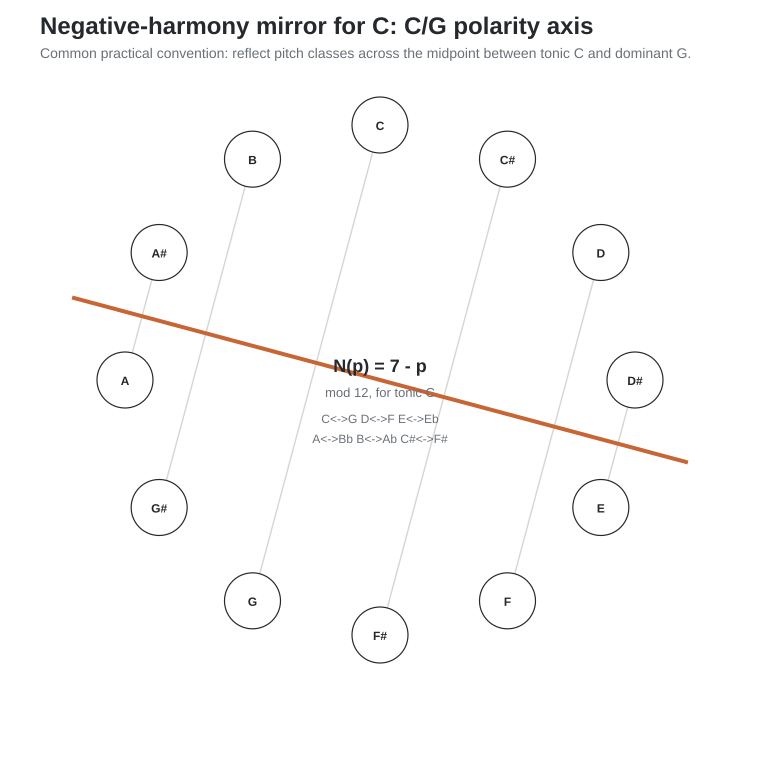

The resulting pitch-class pairs are:

| Positive | Negative | Positive | Negative |
| --- | --- | --- | --- |
| C | G | G | C |
| C#/Db | F#/Gb | F#/Gb | C#/Db |
| D | F | F | D |
| Eb | E | E | Eb |
| Ab | B | B | Ab |
| A | Bb | Bb | A |

Because reflection reverses interval direction, note order is usually normalized after the mapping so the result can be read as an ordinary chord or scale.

## F.2 Major becomes minor around the same tonal center

Reflect C major:

`C E G → G Eb C → C Eb G = Cm`

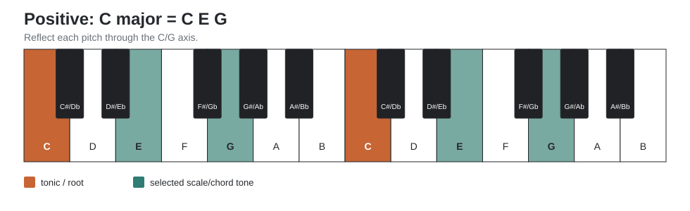

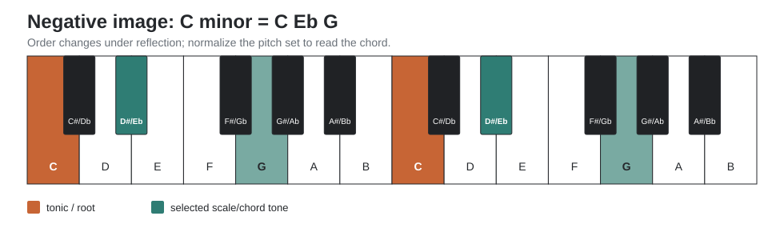

Reflecting the C-major scale gives the pitch collection of C natural minor:

`C D E F G A B → G F Eb D C Bb Ab`

Reordered from C:

`C D Eb F G Ab Bb`

This does **not** mean that major and natural minor are interchangeable; it means the reflection maps one collection to the other under this chosen axis.

## F.3 Chord examples in C

| Positive harmony | Pitches | Negative image | Equivalent spelling |
| --- | --- | --- | --- |
| C major (I) | C E G | G Eb C | C minor (i) |
| D minor (ii) | D F A | F D Bb | Bb major (bVII) |
| E minor (iii) | E G B | Eb C Ab | Ab major (bVI) |
| F major (IV) | F A C | D Bb G | G minor (v) |
| G major (V) | G B D | C Ab F | F minor (iv) |
| A minor (vi) | A C E | Bb G Eb | Eb major (bIII) |
| B diminished (vii dim) | B D F | Ab F D | D diminished (ii dim) |

A particularly useful dominant example is:

`G7 = G B D F → C Ab F D = D F Ab C = Dm7b5`

The same pitch set can be heard or voiced as `Fm6 = F Ab C D`. This is one reason the minor-subdominant family appears naturally in negative-harmony demonstrations.

## F.4 A practical reharmonization workflow

1. Choose a tonal center and keep the axis fixed for the passage.
2. Reduce the source chord or melody to actual pitch classes; do not transform only the chord symbol.
3. Reflect each pitch using the mapping table or formula.
4. Reorder the resulting pitch set into a readable chord.
5. Choose an inversion/voicing that preserves useful voice leading.
6. Listen for function. Keep, alter, or reject the result according to the music rather than the transformation alone.

### Exercise F1 - Mirror a cadence

In C major, transform:

`Dm7 → G7 → Cmaj7`

Map every chord tone. Then voice the negative sequence on piano with the smallest possible motion. Compare the original and transformed bass motion, tendency tones, and final sense of arrival.

### Exercise F2 - Mirror a melody, then reharmonize

Write a four-bar melody in C major. Reflect every pitch through the C/G axis. Keep the rhythm unchanged. First play the mirrored melody over a C pedal; then harmonize it by ear. Only after that, compare the result with mechanically reflected chords.

### Exercise F3 - Transpose the method

Repeat the operation in Db, E, F#, and Ab. Do **not** memorize a C-only table. Use the general formula or construct the tonic/dominant axis in the new key.

## F.5 Limits and variants

- The tonic/dominant midpoint is a common practical convention, but inversion axes can be chosen differently for other compositional purposes.
- Enharmonic spelling after reflection is analytical rather than purely mechanical. Choose spellings that make the resulting harmony readable in context.
- Negative harmony preserves a mathematical symmetry, not every psychoacoustic, stylistic, or historical property of tonal function.
- It is most useful as a generator of alternatives: mirrored melodies, modal mixture, minor-subdominant colors, contrary motion, and voice-leading experiments.

# Appendix G - Sources and product-layout notes

This manual's general theory material is standard Western tonal/modal theory. Product-layout descriptions were checked against current Ableton documentation in September 2026.

- Ableton Push 3 Reference Manual: https://www.ableton.com/en/push/manual/
- Ableton Push manual/help index: https://help.ableton.com/hc/en-us/articles/206328564-Push-User-Manual
- Ableton Note Manual: https://www.ableton.com/en/note/manual/
- Ernst Levy, *A Theory of Harmony* (conceptual source for harmonic polarity / negative-harmony practice).

For Push and Note, this edition intentionally depicts **Chromatic mode only**. Push diagrams use the chromatic fourths geometry as the main comparison with guitar; Note diagrams use Chromatic/Fourths with In Key disabled. Scale tones may be visually emphasized, but no out-of-scale pitch is removed.

The Push, Note, piano, guitar, circle, voice-leading, and negative-harmony figures are original teaching diagrams, not screenshots of product interfaces.

# One-page philosophy

The piano does not need to become isomorphic for transposition to become immediate.

Your invariant representation is:

`function → pitch spelling → register → instrument geometry`

A guitarist often encounters instrument geometry first because movable shapes can encode function while moving the whole sounding object through register. The aim is not to discard that motor knowledge, but to be able to move in both directions: from geometry back to function, spelling, and register, and from those abstractions into a new physical realization. A pianist faces the complementary problem: the fixed topography of white and black keys makes absolute pitch location explicit while the hand geometry changes across keys.

The black keys are therefore not exceptions to the system. They are the coordinate system that lets the non-isomorphic keyboard become navigable.
